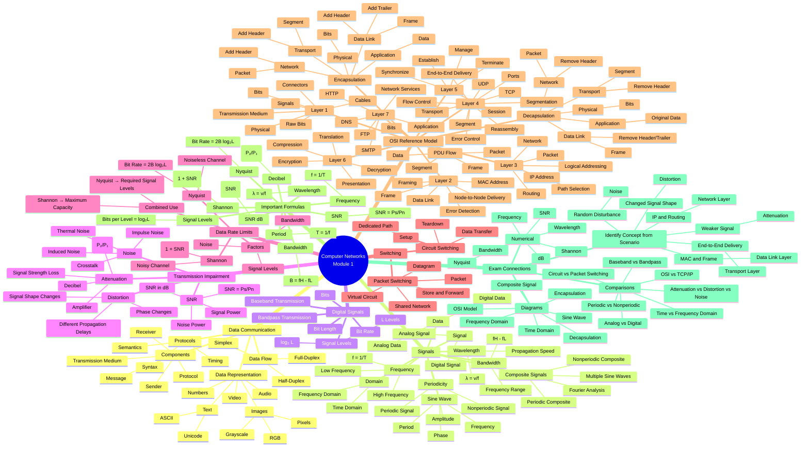

# 🌐 Computer Networks — Module 1 Mind Map

```mermaid
mindmap
  root((Computer Networks<br/>Module 1))

    Data Communication
      Components
        Sender
        Receiver
        Message
        Transmission Medium
        Protocol
      Data Representation
        Text
          Unicode
          ASCII
        Numbers
        Images
          Pixels
          Grayscale
          RGB
        Audio
        Video
      Data Flow
        Simplex
        Half-Duplex
        Full-Duplex
      Protocols
        Syntax
        Semantics
        Timing

    Signals
      Data
        Analog Data
        Digital Data
      Signal
        Analog Signal
        Digital Signal
      Periodicity
        Periodic Signal
        Nonperiodic Signal
      Sine Wave
        Amplitude
        Frequency
        Phase
        Period
      Frequency
        f = 1/T
        High Frequency
        Low Frequency
      Wavelength
        λ = v/f
        Propagation Speed
      Domain
        Time Domain
        Frequency Domain
      Composite Signals
        Multiple Sine Waves
        Fourier Analysis
        Periodic Composite
        Nonperiodic Composite
      Bandwidth
        fH - fL
        Frequency Range

    Digital Signals
      Bits
      Bit Rate
      Bit Length
      Signal Levels
        L Levels
        log₂ L
      Baseband Transmission
      Bandpass Transmission

    Transmission Impairment
      Attenuation
        Signal Strength Loss
        Amplifier
        Decibel
        dB = 10 log₁₀(P₂/P₁)
      Distortion
        Signal Shape Changes
        Different Propagation Delays
        Phase Changes
      Noise
        Thermal Noise
        Induced Noise
        Crosstalk
        Impulse Noise
      SNR
        Signal Power
        Noise Power
        SNR = Ps/Pn
        SNR in dB

    Data Rate Limits
      Factors
        Bandwidth
        Signal Levels
        Noise
      Nyquist
        Noiseless Channel
        Bit Rate = 2B log₂L
      Shannon
        Noisy Channel
        C = B log₂(1 + SNR)
      Combined Use
        Shannon → Maximum Capacity
        Nyquist → Required Signal Levels

    Switching
      Circuit Switching
        Dedicated Path
        Setup
        Data Transfer
        Teardown
      Packet Switching
        Packet
        Store and Forward
        Shared Network
        Datagram
        Virtual Circuit

    OSI Reference Model
      Layer 7
        Application
        Network Services
        HTTP
        FTP
        SMTP
        DNS
      Layer 6
        Presentation
        Translation
        Encryption
        Decryption
        Compression
      Layer 5
        Session
        Establish
        Manage
        Synchronize
        Terminate
      Layer 4
        Transport
        End-to-End Delivery
        Segmentation
        Reassembly
        Flow Control
        Error Control
        TCP
        UDP
        Ports
        Segment
      Layer 3
        Network
        Logical Addressing
        IP Address
        Routing
        Path Selection
        Packet
      Layer 2
        Data Link
        Framing
        MAC Address
        Error Detection
        Node-to-Node Delivery
        Frame
      Layer 1
        Physical
        Raw Bits
        Signals
        Transmission Medium
        Cables
        Connectors
        Bits

      PDU Flow
        Data
        Segment
        Packet
        Frame
        Bits

      Encapsulation
        Application
          Data
        Transport
          Add Header
          Segment
        Network
          Add Header
          Packet
        Data Link
          Add Header
          Add Trailer
          Frame
        Physical
          Bits

      Decapsulation
        Physical
          Bits
        Data Link
          Frame
          Remove Header/Trailer
        Network
          Packet
          Remove Header
        Transport
          Segment
          Remove Header
        Application
          Original Data

    Important Formulas
      Period
        T = 1/f
      Frequency
        f = 1/T
      Wavelength
        λ = v/f
      Bandwidth
        B = fH - fL
      Decibel
        dB = 10 log₁₀(P₂/P₁)
      SNR
        SNR = Ps/Pn
      SNR dB
        SNRdB = 10 log₁₀(SNR)
      Nyquist
        Bit Rate = 2B log₂L
      Shannon
        C = B log₂(1 + SNR)
      Signal Levels
        Bits per Level = log₂L

    Exam Connections
      Identify Concept from Scenario
        Weaker Signal
          Attenuation
        Changed Signal Shape
          Distortion
        Random Disturbance
          Noise
        IP and Routing
          Network Layer
        MAC and Frame
          Data Link Layer
        End-to-End Delivery
          Transport Layer
      Numerical
        Bandwidth
        Wavelength
        Frequency
        dB
        SNR
        Nyquist
        Shannon
      Diagrams
        Sine Wave
        Time Domain
        Frequency Domain
        Composite Signal
        OSI Model
        Encapsulation
        Decapsulation
      Comparisons
        Analog vs Digital
        Periodic vs Nonperiodic
        Time vs Frequency Domain
        Baseband vs Bandpass
        Circuit vs Packet Switching
        Attenuation vs Distortion vs Noise
        OSI vs TCP/IP
```